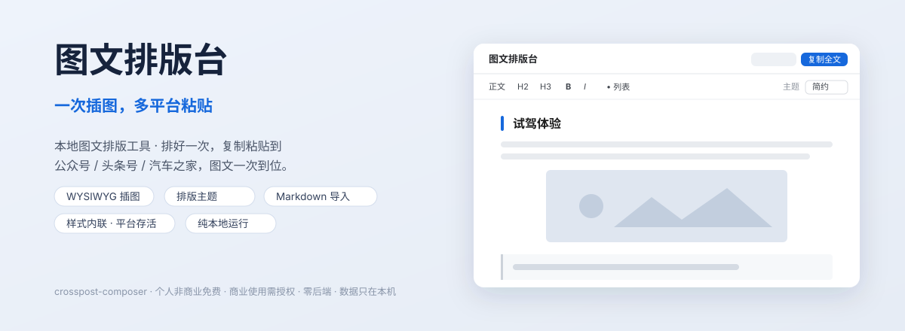

<h1 align="center">Crosspost Composer</h1>

<p align="center">
  <strong>Insert images once. Paste to multiple publishing platforms.</strong><br>
  A browser-based, local-first rich-text workspace with no account or installation required.
</p>

<p align="center">
  <a href="https://arvin62.github.io/crosspost-composer/"><strong>Open the web app</strong></a> ·
  <a href="README.md">中文</a>
</p>

<p align="center">
  <a href="https://github.com/Arvin62/crosspost-composer/actions/workflows/ci.yml"></a>
  <a href="LICENSE"></a>
</p>

<p align="center">
  
</p>

## What it does

Crosspost Composer is built for creators who distribute the same illustrated article to multiple content platforms. Prepare the text, images, and layout in one browser workspace, run a platform-specific preflight, and paste the result into the target editor.

The web app requires no account, backend, terminal, or local installation.

> **Open-source license:** Starting 2026-08-13, this public repository is available under the [Apache License 2.0](LICENSE). Use, modification, redistribution, and commercial use are allowed subject to the license and [NOTICE](NOTICE). The private PRO product is not included in this repository; see the [boundary statement](COMMERCIAL-LICENSE.md).

## Workflow

**Import an article → add and arrange images → choose a theme → run preflight → copy and publish**

## Key features

- Import HTML or Markdown and edit with a focused rich-text toolbar.
- Paste, drag, compress, crop, rotate, caption, align, and reorder images.
- Apply built-in themes and inline compatible styles when copying.
- Generate platform-specific output for WeChat, Toutiao/Baijiahao, Autohome, Zhihu, and generic rich-text editors.
- Manage multiple documents, autosaves, manual snapshots, search, outline navigation, and find/replace.
- Export or restore a full JSON backup containing documents, embedded images, snapshots, and settings.

## Privacy

The application has no account system, content backend, analytics, or cloud sync. Documents and images stay in the current browser's IndexedDB and localStorage. Export a full backup before changing browsers, devices, or site data.

HTML and Markdown imports remove network images, remote styles, and embedded resources by default. If you explicitly keep network images, the browser will contact those image hosts and they may record your IP address; retained images use a no-referrer policy.

The public web app is hosted on GitHub Pages, which may process basic access information such as visitor IP addresses under [GitHub's own policies](https://docs.github.com/pages/getting-started-with-github-pages/what-is-github-pages#data-collection).

## Platform notes

| Platform | Status | Notes |
|---|:---:|---|
| WeChat Official Accounts | ✅ | Images and inline styles have the best retention |
| Toutiao / Baijiahao | ✅ | Structure and images are retained; the platform may normalize styles |
| Autohome | ✅ | Rich-text paste supported; final appearance depends on the editor |
| Zhihu | ⚠️ | Semantic HTML only; embedded images must be replaced with public URLs |

## Local development

Requires Node.js 22.12 or later.

```bash
git clone https://github.com/Arvin62/crosspost-composer.git
cd crosspost-composer
npm ci
npm run dev
```

```bash
npm test
npm run typecheck
npm run build
```

## Maintenance and security

Use the structured [Issue forms](https://github.com/Arvin62/crosspost-composer/issues/new/choose)
for reproducible bugs, dated platform compatibility results, and feature requests.
Report vulnerabilities privately under [SECURITY.md](SECURITY.md); never post an
unpublished draft, workspace backup, cookie, token, or API key in a public issue.

Maintainer responsibilities are recorded in [MAINTAINERS.md](MAINTAINERS.md), the
current attack surface in the [threat model](docs/security/threat-model.md), and
planned work in [ROADMAP.md](ROADMAP.md). Code contributions are accepted under
Apache-2.0 inbound=outbound terms with a Developer Certificate of Origin sign-off;
see [CONTRIBUTING.md](CONTRIBUTING.md).

## License

Copyright 2026 Arvin62.

- The public repository is open source under the [Apache License 2.0](LICENSE). Use, modification, redistribution, and commercial use are allowed subject to the license and applicable [NOTICE](NOTICE) requirements.
- The private PRO product, services, and proprietary code not included in this repository are outside this repository's license; see the [public-core/private-product boundary](COMMERCIAL-LICENSE.md).
- Third-party components remain under their respective licenses; see [THIRD_PARTY_NOTICES.md](THIRD_PARTY_NOTICES.md).
